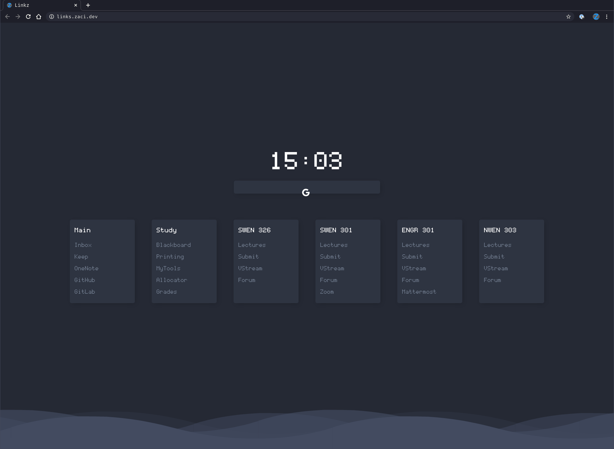

# Quick Links
> Live: [links.zaci.dev](https://links.zaci.dev)

A Gitpage containing all my links to relevant course pages.

Feel free to use fellow students.

The website can be visited at [links.zaci.dev](https://links.zaci.dev).

## Author

Full credit to original author / repo: [Tobias-Schoch](https://github.com/Tobias-Schoch/startpage-wave).

Adapted by Zac Scott [scottzach1](https://github.com/scottzach1/).